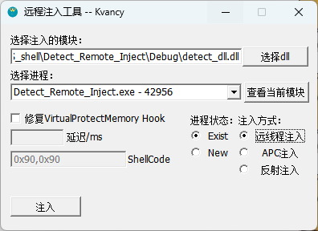

# 项目简介

KvRemote-Inject-Tools是在Windows平台上的注入工具，可以方便快捷的实现远程注入。

# 目前实现的功能

1. 支持用文件系统选择要注入的模块
2. 支持直接拖拽文件，选择需要注入的模块
3. 支持进程枚举，点击选择进程（可识别中文进程）
4. 可修复ZwVirtualProtectMemory hook，用于特定进程hook了自身的ZwVirtualProtectMemory函数的情况
5. 注入配置保存，添加config.ini文件支持配置在关闭时保存，下次打开自动填充。
6. 枚举目标进程所有模块，可以判断是否注入成功
7. 支持启动新进程并可以进行延迟注入

8. 支持APC注入和ShellCode注入

# 效果图

# TODO

1. 多dll注入支持
3. 卸载目标进程的已注入的模块
4. 驱动层注入